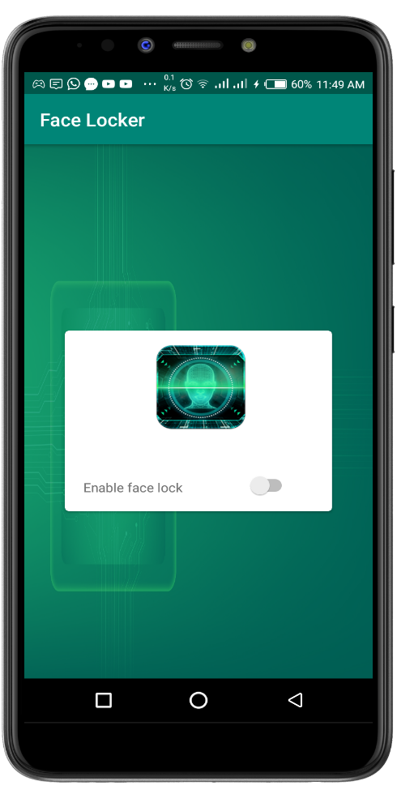
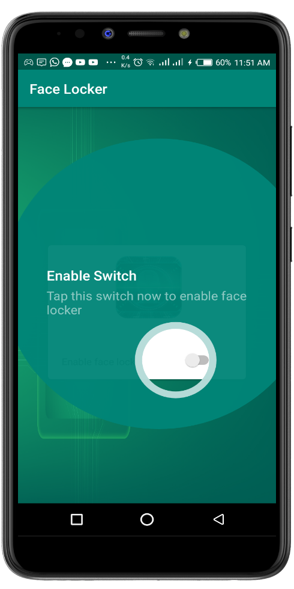
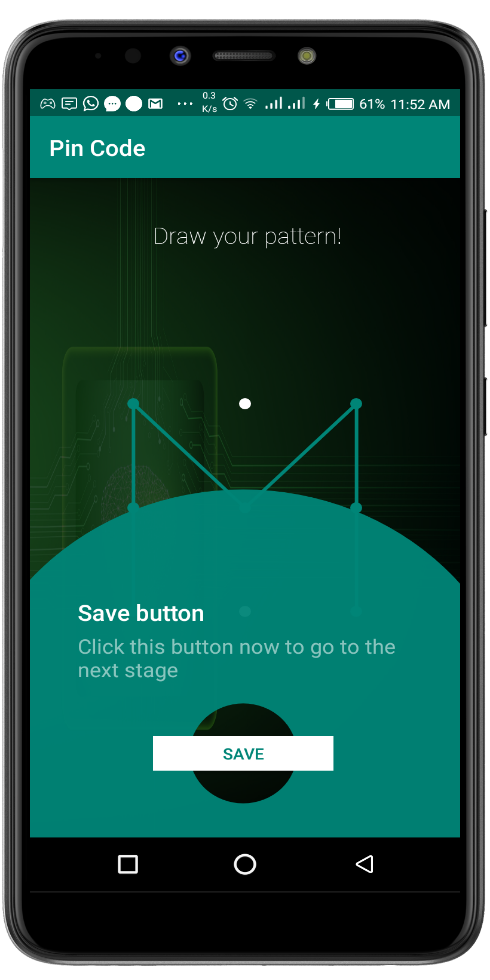
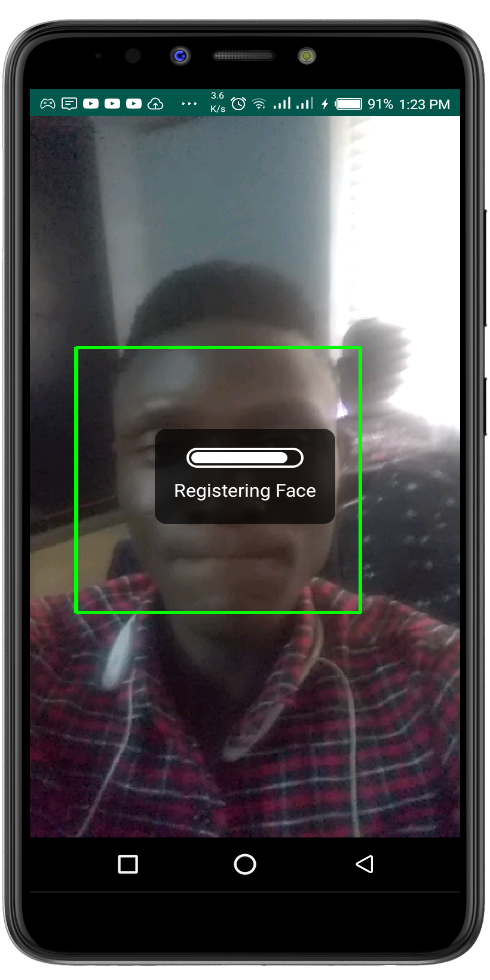

# FaceLocker
A machine learning android application that helps to lock your android phone using face recognition.
### Download App

### Features
- Automatic Lock
- Face Unlock
- Pattern Unlock
- Pincode Unlock
- Multiple User Lock and Unlock

## Screenshots

## Getting Started
### Libraries/Tools
- Java
- [Android Studio](ttps://developer.android.com/studio/)
- [OpenCv](https://github.com/bytedeco/javacv)
- [PatternLockView](https://github.com/aritraroy/PatternLockView)
- [TapTargetView](https://github.com/KeepSafe/TapTargetView)

## let's connect to learn together

- [Twitter](https://twitter.com/israelalagbe)
- [Github](https://github.com/israelalagbe)
- [LinkedIn](https://www.linkedin.com/in/israel-alagbe-2b823a138/)
- [Facebook](https://www.facebook.com/alagbeisrael)

### License

    Copyright 2018 Israel Alagbe
    
    Licensed under the Apache License, Version 2.0 (the "License");
    you may not use this file except in compliance with the License.
    You may obtain a copy of the License at

       http://www.apache.org/licenses/LICENSE-2.0

    Unless required by applicable law or agreed to in writing, software
    distributed under the License is distributed on an "AS IS" BASIS,
    WITHOUT WARRANTIES OR CONDITIONS OF ANY KIND, either express or implied.
    See the License for the specific language governing permissions and
    limitations under the License.